<p align="center">
  
</p>

> A high-performance, production-grade full-stack platform for managing, analyzing, and visualizing ride-hailing vehicle booking data. Designed around a real-world dataset of **18,289 vehicle booking records** from Bangalore, India, **RideOps** integrates a robust RESTful API backend with a state-of-the-art interactive administration dashboard.

---

<br/>

<div align="center">

[](https://vehicle-bookings.vercel.app/)
[](https://vehicle-bookings.onrender.com/)
[](https://documenter.getpostman.com/view/50841281/2sBXwmRDbN)

</div>

---

## 📋 Table of Contents

- [🔗 Project Links](#-project-links)
- [📝 Problem Statement](#-problem-statement)
- [💡 Solution Overview](#-solution-overview)
- [✨ Key Features](#-key-features)
- [🛠️ Tech Stack](#-tech-stack)
- [📁 Project Structure](#-project-structure)
- [📸 Project Screenshots](#-project-screenshots)
- [🌌 System Architecture](#-system-architecture)
- [🚀 Getting Started](#-getting-started)
- [📊 Dataset Information](#-dataset-information)
- [🔒 Security & Middleware](#-security--middleware)
- [⚡ Scripts & Command Reference](#-scripts--command-reference)
- [📖 API Reference & Postman](#-api-reference--postman)

---

## 📝 Problem Statement

Modern ride-hailing services generate massive volumes of transactional data daily. Operations administrators and fleet managers struggle to efficiently parse, audit, and extract actionable business intelligence from hundreds of thousands of raw, unstructured booking files. The lack of a unified dashboard leads to major bottlenecks, including:
1. **Inefficient Data Parsing:** Difficulty in searching, sorting, and filtering records over a large real-world dataset (such as 18k+ records).
2. **State & Analytics Disconnect:** Minimal visibility into key operational metrics like total revenue, ride success rate, and active ride distributions.
3. **Audit Complexity:** No visual tool to inspect specific booking records or compare multiple bookings side-by-side to identify anomalies.
4. **Lack of Role-Based Security:** Unrestricted data access exposes sensitive logistics coordinates to unauthorized personnel.

---

## 💡 Solution Overview

**RideOps** solves these challenges by bridging the gap between raw data aggregation and operational intelligence. It provides a production-grade, full-stack fleet console built with **React 19** and **Node.js (Express 5)**, featuring:
*   **High-Throughput Analytics:** Instantly aggregates 18,289 raw bookings into interactive, responsive KPI components.
*   **Cursor-Based Pagination Engine:** Enables extremely fast search, filter, and page traversal speeds.
*   **Admin-Only Auditing Controls:** Provides specialized interfaces to inspect individual details, modify entries, compare bookings, and manage user roles.
*   **Decoupled & Secured Architecture:** Utilizes robust JWT auth with role-based restrictions (RBAC) to ensure only authorized admins can perform mutative actions.

---

## ✨ Key Features

### Frontend Console (Client)
*   📊 **Interactive Dashboard**: Visualizes critical key performance indicators (KPIs) like total revenue, ride success rate, and active bookings with custom micro-animations.
*   📈 **Rich Analytics Dashboard**: Advanced data visualization using `recharts`, breaking down payment methods, customer distributions, and vehicle-specific revenue trends.
*   🔍 **Advanced Booking Directory**: Search, filter, and sort bookings through complex criteria utilizing cursor-based server-side pagination for optimal performance.
*   🛡️ **Role-Based Views**: Automatic UI adjustments based on user privileges (e.g., admin-only create/edit actions and user-management tables).
*   ⚖️ **Side-by-Side Comparison**: Multi-booking validator allowing administrators to compare two rides side-by-side.
*   🎨 **Premium Styling**: Glassmorphic elements, modern gradients, Outfit typography, and curated colors (dark mode styling).

### Backend REST API (Server)
*   ⚡ **High-Throughput Seeder**: Seeds and sanitizes **18,289 records** in optimized batches.
*   🔒 **JWT Auth & Role-Based RBAC**: State-controlled user accounts with hashed passwords (`bcryptjs`) and scoped API endpoints (User vs. Admin).
*   📈 **MongoDB Aggregation Pipelines**: Built-in endpoints utilizing multi-stage aggregations (`$group`, `$match`, `$sort`, `$project`) to return deep statistical insights in milliseconds.
*   🤖 **AI Summary API**: Auto-computes analytics, anomalies, and statistics, outputting synthesized executive summaries.
*   🚦 **Tiered Rate Limiter**: Independent request caps for auth, searching, and general routes to prevent denial of service.
*   🧪 **Test Suite**: Automated API validation suite testing over 35 unique cases including CRUD, authentication bounds, and aggregation endpoints.

---

## 🛠️ Tech Stack

### Frontend
*   **Vite**: Next-generation frontend tooling.
*   **React 19**: Modern UI component architecture.
*   **Redux Toolkit**: Predictable state management container.
*   **Recharts**: Composable declarative charting library.
*   **Formik & Yup**: Robust form management and schema-based client validation.
*   **Lucide React**: Clean and consistent vector icons.

### Backend
*   **Node.js & Express.js (v5)**: High-performance asynchronous backend server.
*   **MongoDB & Mongoose (v9)**: Schema-driven ODM modeling document collections.
*   **JSON Web Tokens (JWT)**: Stateless secure token-based user sessions.
*   **bcryptjs**: Blowfish-based password hashing algorithm.
*   **express-rate-limit**: Middleware-level request rate control.

---

## 📁 Project Structure

```
Vehicle_Bookings/
├── Backend/
│   ├── config/            # MongoDB connection configuration
│   ├── controllers/       # HTTP Request/Response controllers (MVC)
│   ├── data/              # Raw Bangalore bookings JSON dataset (18,289 rows)
│   ├── middlewares/       # Security, JWT, Rate Limiting, validation schemas
│   ├── models/            # Database schema models (Booking, User)
│   ├── routes/            # Declared HTTP routes (Auth, Booking, Admin, Stats)
│   ├── scripts/           # Seeding, backups, and test suites
│   ├── services/          # Core Business Logic & Query pipelines
│   ├── utils/             # Helper utilities (Cursor pagination engine)
│   ├── .env.example       # Template environment variables
│   ├── package.json       # Backend configurations & dependencies
│   └── server.js          # App bootstrapper and server entrypoint
│
├── Frontend/
│   ├── public/            # Static assets
│   │   └── Screenshots/   # Operational dashboard screenshots
│   ├── src/
│   │   ├── components/    # Reusable UI elements & layouts
│   │   ├── hooks/         # Custom React hooks
│   │   ├── lib/           # Axios instance configuration
│   │   ├── pages/         # View structures (Dashboard, Analytics, Auth)
│   │   ├── state/         # State definitions
│   │   ├── store/         # Redux Toolkit global store and slices
│   │   ├── styles.css     # Premium stylesheet
│   │   ├── App.jsx        # Routing tree and layout shells
│   │   └── main.jsx       # Client entry mounting script
│   ├── vite.config.js     # Bundler configuration
│   └── package.json       # Client configurations & dependencies
│
└── README.md              # Documentation Mainframe
```

---

## 📸 Project Screenshots

| Page / Component | Preview |
| :--- | :--- |
| **01. Login Portal** | 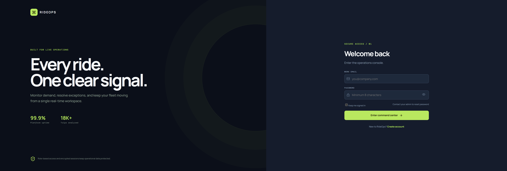 |
| **02. User Registration** | 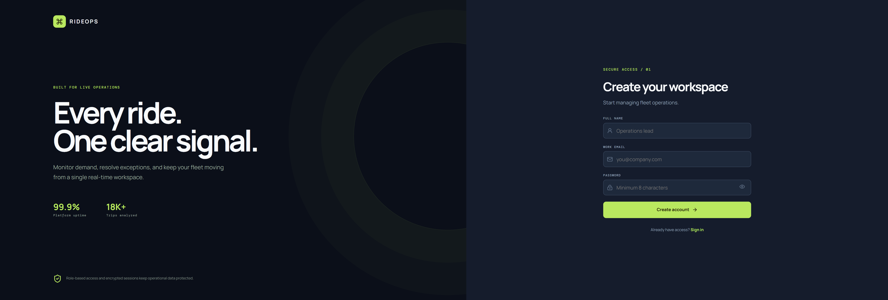 |
| **03. Main KPI Dashboard** | 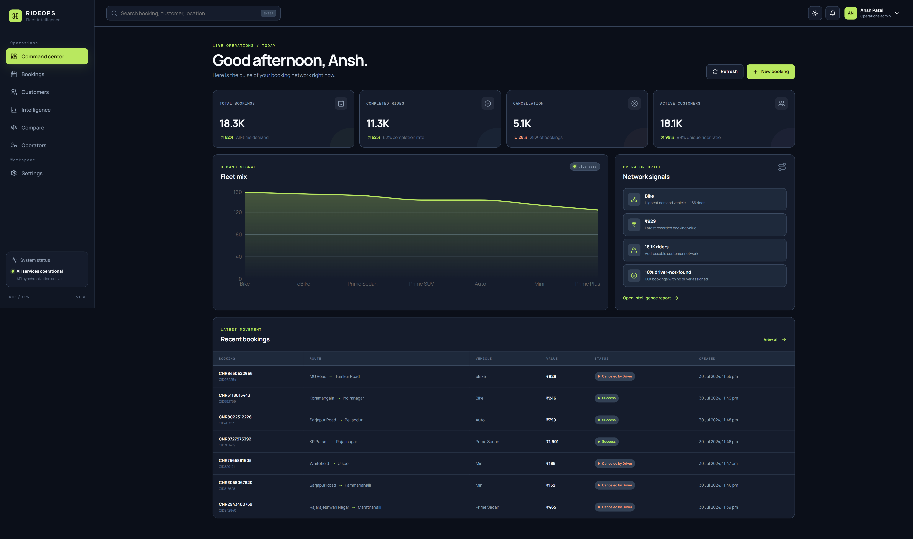 |
| **04. Rich Analytics & Charts** | 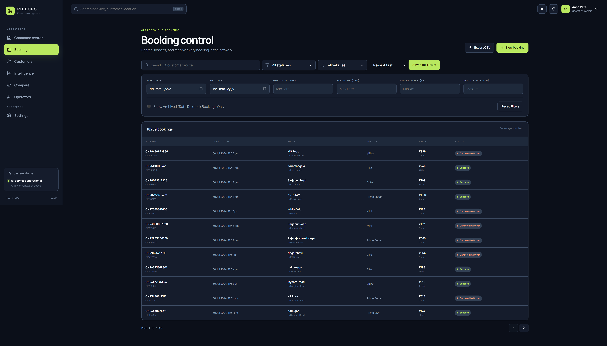 |
| **05. Advanced Bookings Directory** | 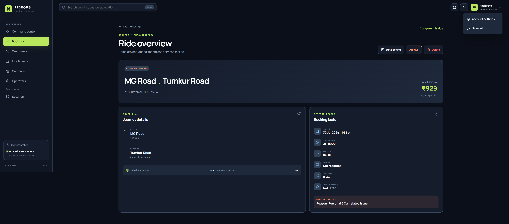 |
| **06. Detailed Booking Audit** | 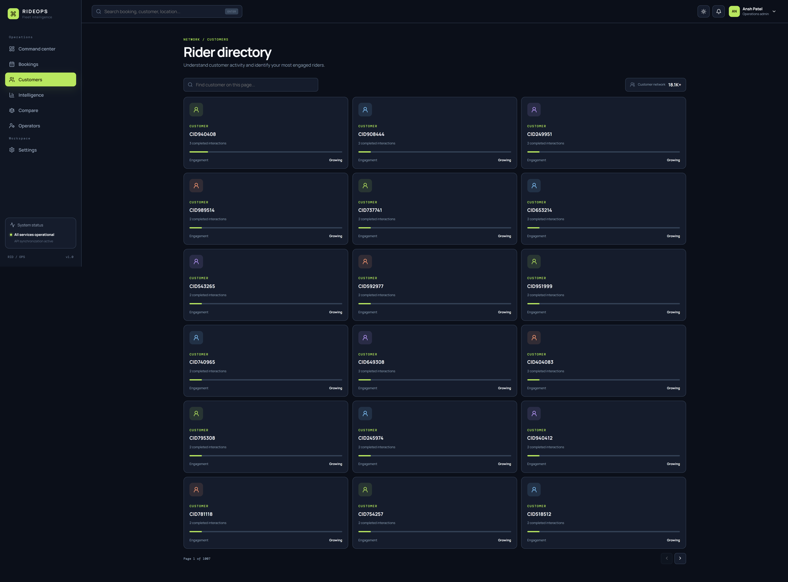 |
| **07. Booking Creator / Editor** | 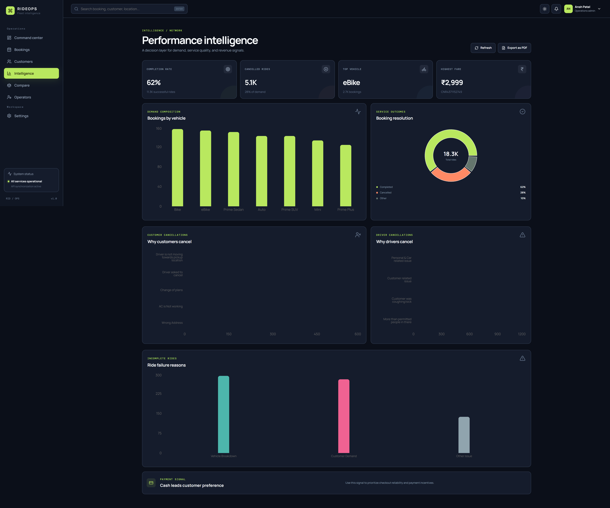 |
| **08. Side-by-Side Comparison** | 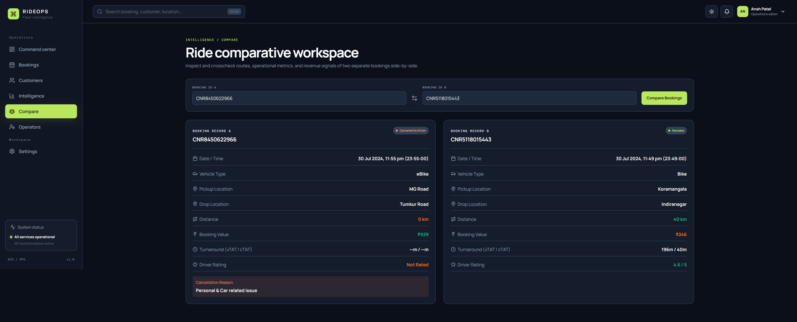 |
| **09. Customers Overview** | 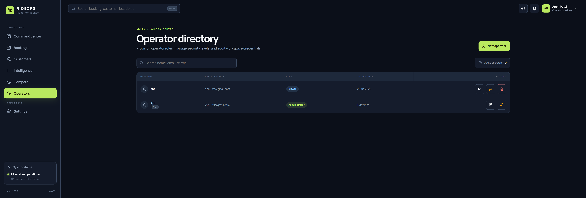 |
| **10. Administrative User Management** | 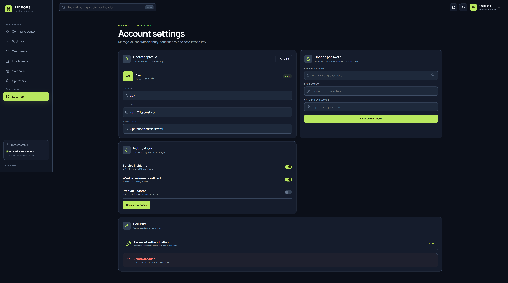 |

---

## 🌌 System Architecture

RideOps is built with a modern decoupled architecture:
1. **Frontend Console (Vite + React 19 + Redux Toolkit)**: A responsive Single Page Application (SPA) utilizing lazy loading, component-driven layouts, and a centralized store for state.
2. **Backend API (Node.js + Express 5 + MongoDB/Mongoose)**: A structured REST API utilizing the **MVC + Service Layer** pattern. Services encapsulate business logic and database queries, controllers handle request-response cycles, and middlewares manage security, logging, and validations.

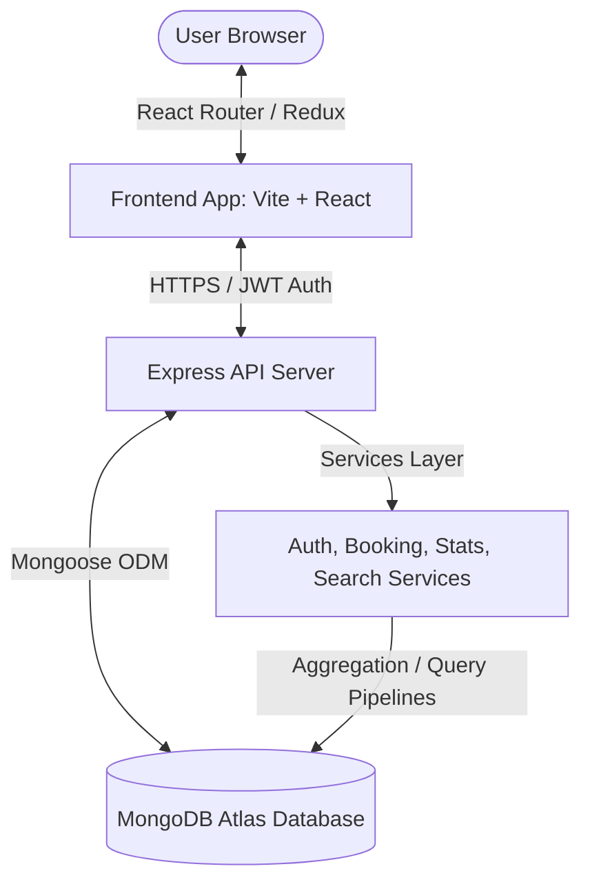

---

## 📊 Dataset Information

RideOps processes an anonymized dataset comprising **18,289 bookings** in Bangalore, India.

| Attribute | Data Type | Description | Example |
| :--- | :--- | :--- | :--- |
| `bookingId` | String | Unique alpha-numeric identifier | `CNR7153255142` |
| `date` | Date | Day the reservation was requested | `2026-06-21` |
| `time` | String | Time of booking placement | `12:27:04` |
| `bookingStatus` | String | Current status of the ride | `Success`, `Canceled by Driver` |
| `vehicleType` | String | Type of class chosen | `Prime Sedan`, `eBike`, `Auto` |
| `pickupLocation` | String | Initial passenger pick up point | `Indiranagar, Bangalore` |
| `dropLocation` | String | Intended destination | `Whitefield, Bangalore` |
| `bookingValue` | Number | Ride cost in Indian Rupees (INR) | `350` |
| `rideDistance` | Number | Measured length in kilometers | `12.5` |
| `paymentMethod` | String | Billing type | `UPI`, `Cash`, `Credit Card` |
| `driverRatings` | Number | Feedback scale (1.0 to 5.0) | `4.8` |

---

## 🔒 Security & Middleware

RideOps implements industry-standard safety practices at every API boundary:

*   **Bcrypt Password Cryptography**: User passwords are encrypted with a work factor salt before being stored in the database.
*   **JWT Stateless Handshakes**: Signed JWTs are used for identity verification. Tokens contain role scopes (`user` or `admin`) that are enforced using custom role verification middlewares.
*   **Tiered Limit Control**:
    *   `Auth Routes`: Max 5 login/registration requests per 15 minutes.
    *   `Search Routes`: Max 30 queries per minute.
    *   `Admin/Data Operations`: Max 20 write queries per minute.
    *   `General Public Endpoints`: Max 100 requests per minute.
*   **Cross-Origin Configuration (CORS)**: Restricts accessibility from unauthorized domains.

---

## ⚡ Scripts & Command Reference

### Backend Commands (`/Backend`)

*   `npm start`: Runs the server in production mode.
*   `npm run dev`: Runs the API server under node monitoring.
*   `npm run seed`: Clears the current bookings collection and uploads the dataset.
*   `npm test`: Launches the 35 API validation test suite.

### Frontend Commands (`/Frontend`)

*   `npm run dev`: Boots the local Vite development server.
*   `npm run build`: Bundles the React assets into highly optimized, minified production files.
*   `npm run preview`: Statically serves the built `dist` folder.
*   `npm run lint`: Verifies static styling rules and imports.

---

## 📖 API Reference & Postman

A comprehensive list of the **117+ backend routes** can be found in the [Backend README.md](Backend/README.md) file. 

For interactive API testing, you can import the preconfigured **Postman Workspace**:
👉 **[Postman Documentation Link](https://documenter.getpostman.com/view/50841281/2sBXwmRDbN)**

---

<p align="center">
  Built with ❤️ by <a href="https://github.com/AnshPatel191207">Ansh Patel</a>
</p>
